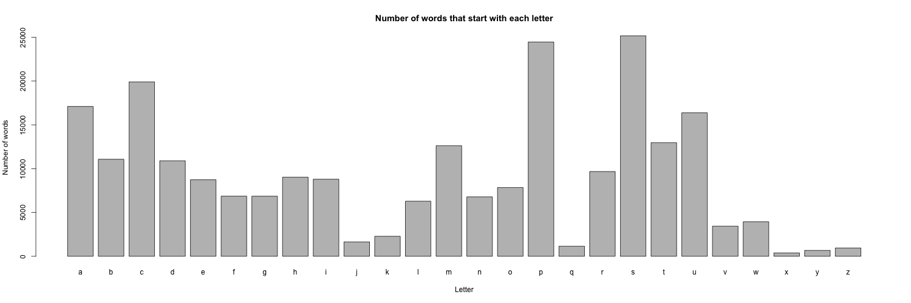

```{r}
bar_dat <- read.delim("firstletter.tsv")
```

I computed the number of words that started with each letter of the alphabet

The most common first letter of a word was `r with(bar_dat, lowfirst[which.max(Freq)])`

Here is a barplot of the number of words starting with each letter




